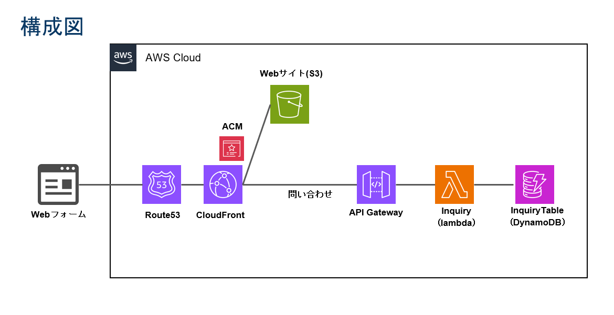
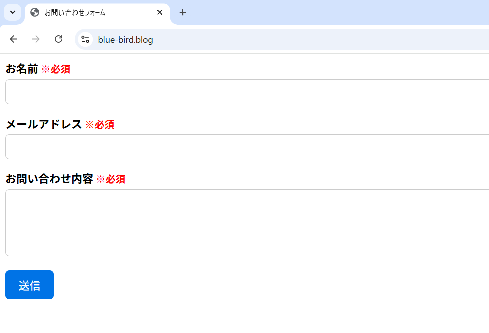
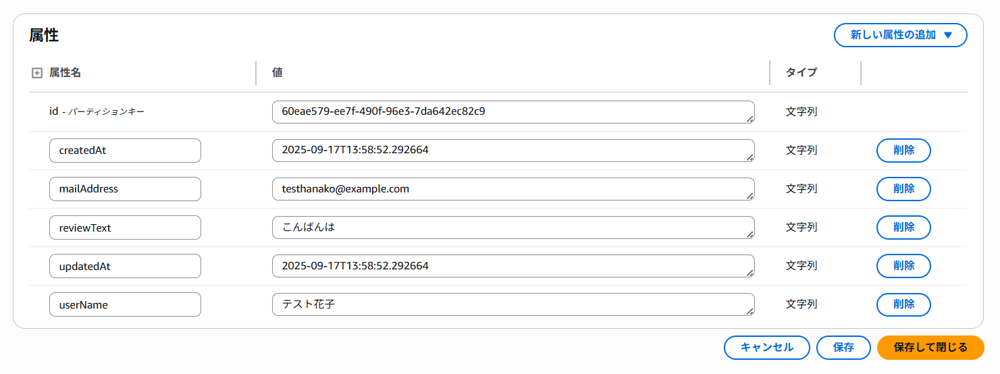

# AWS サーバーレス お問い合わせフォーム

AWS サービスを使用したサーバーレスお問い合わせフォームの作成

## システム構成

```
ユーザー → Webフォーム:CloudFront → S3（https://blue-bird.blog）
↓
ブラウザのJavaScript → API Gateway（https://api-gateway-url） → Lambda → DynamoDB
```


## 前提条件

- AWS アカウント
- 取得済みドメイン（例：お名前.com で取得した blue-bird.blog）

### リクエストの流れ
1. ユーザーが `https://blue-bird.blog` でフォーム送信
2. CSP チェック: ブラウザが「connect-src」設定を確認し、API Gateway への接続を許可
3. JavaScript実行: `fetch()` で API Gateway にPOSTリクエスト送信
4. CORS チェック: Lambda が `Access-Control-Allow-Origin` ヘッダーを付けてレスポンス
5. ブラウザが`Access-Control-Allow-Origin`ヘッダーにhttps://blue-bird.blog が設定されていることを確認し、レスポンスを JavaScript に渡す

## 【前提知識】CORS と CSP について

### CORS（Cross-Origin Resource Sharing）とは
- フロントエンド（例：blue-bird.blog）からバックエンド API（例：api-gateway-url）へリクエストを送信する際、ブラウザのセキュリティ制限を回避するために CORS の設定が必要
- CORS とは、ブラウザが「異なるオリジン（ドメイン、プロトコル、ポートの組み合わせ）」からのリソースへのアクセスを、安全に許可するかどうかを判断する仕組み
   ブラウザには 「同一オリジンポリシー（Same-Origin Policy）」 というセキュリティ原則があり、デフォルトでは別サイトの API から返ってきた内容を JavaScript で読み取ることが禁止されている
   CORS設定が無いと、API からデータは返ってくるが、ブラウザが「許可証がない」と判断し、JavaScript（fetch 等）にデータを渡さないため、影響として、画面上に「送信完了」や「取得データ」を表示できなくなる
- 本システムでの解決策API（Lambda）側のレスポンスヘッダーに、特定のオリジンからのアクセスを許可する宣言を追加する
  - ヘッダー　Access-Control-Allow-Origin　設定値（例：https://blue-bird.blog ） を設定し、ブラウザに対し「このサイトなら中身を公開してOK」と伝える

#### 通信のイメージ
- Request: ブラウザ上の JS が API へリクエスト
- Response: API が「許可証（CORSヘッダー）」付きでレスポンス
- Check: ブラウザがヘッダーを確認し、JS へデータを引き渡す

### CSP（Content Security Policy）とは
- XSS攻撃などのリスクを最小化するため、ブラウザに対し、そのページが「どのリソースを読み込んでよいか」「どこにデータを送ってよいか」というホワイトリストを提示する仕組み
- 万が一サイトに悪意のあるスクリプトが混入しても、許可されていない外部サーバー（攻撃者のサーバーなど）へのデータ送信をブラウザが強制的にブロックする
- 通信先を制限する connect-src という項目に、今回の API エンドポイントを明示的に指定する

#### 実装方法
- HTML の <head> セクションに以下のメタタグを記述し、許可する接続先を定義します。
- <meta http-equiv="Content-Security-Policy" content="default-src 'self'; connect-src 'self' https://api-gateway-url;">
  - default-src 'self': 画像やスクリプト等は、自身のサイト（同じオリジン）からのみ許可する
  - connect-src 'self' https://api-gateway-url: API 通信については、自身のサイトに加えて指定した API URL のみを許可する

### まとめ：CORS と CSP の役割分担
CORS: API側が「うちのデータを blue-bird.blog に渡してもいいよ」と許可を出すもの
CSP: サイト側が「うちは api-gateway-url 以外とは通信しちゃダメだよ」と自分を律するもの。

### 設定箇所
- CORS: Lambda コード内の `cors_headers` + 環境変数 `CORS_ORIGIN`
- CSP: HTML の `<meta>` タグ内の `connect-src`

## セットアップ手順

### 1. DynamoDB テーブル作成

1. パーティションキー: `id` (String)
2. その他はデフォルト設定で作成

### 2. Lambda 関数作成

1. ランタイム: Python 
2. IAM実行ロール: DynamoDBFullAccessを追加

Lambda コード
[inquiry-lambda.py](https://github.com/sae-maruyama/inquiry-form/blob/c6c08c7054f8b4ad7e2b0aaaaea95fc0e267c617/inquiry-lambda.py) を参照

5. 環境変数の設定（重要：CORS設定）:
   - `TABLE_NAME`: `InquiryTable`
   - `CORS_ORIGIN`: `https://blue-bird.blog`（実際のドメインに変更）

CORS設定のポイント: 
- すべての `return` 文に `headers: cors_headers` を含める
- 環境変数で簡単にドメインを変更可能
- Lambda プロキシ統合では、API Gateway側ではなくLambda側でCORSを制御する！

### 3. API Gateway 作成

1. API Gateway コンソールで「REST API」を作成
2. リソース:
   - ルートリソース（/）に POST メソッドを作成
   - 統合タイプ: Lambda プロキシ統合
3. デプロイ: ステージを作成してAPI をデプロイ
4. 呼び出し URL をメモ: `https://api-gateway-url`

### 4. S3 バケット作成

1. バケットを作成
2. 静的ウェブサイトホスティングを有効化
3. インデックスドキュメント: `index.html`
4. パブリック読み取りアクセスをブロック

### 5. HTML フォーム作成

index.html:
[index.html](https://github.com/sae-maruyama/inquiry-form/blob/c6c08c7054f8b4ad7e2b0aaaaea95fc0e267c617/index.html) を参照

重要な置き換え箇所:
- `https://api-gateway-url` を実際の API Gateway URL に置き換える（2箇所）

CSP設定のポイント:
- `connect-src` に API Gateway URL を追加
- セキュリティ向上のため推奨だが、削除しても動作する

### 6. CloudFront Distribution 作成

1. CloudFront コンソールで Distribution 作成
2. オリジンドメイン: S3 バケットのバケットエンドポイントを使用
3. SSL 証明書: ACM で証明書を取得（us-east-1 リージョンで作成）

### 7. Route53 設定

1. Route53 コンソールでホストゾーン作成
2. ドメイン名: blue-bird.blog
3. A レコード作成:
   - 名前: blue-bird.blog
   - エイリアス先: CloudFront Distribution
   - CNAMEを追加
4. お名前.com 設定: ネームサーバーを Route53 のものに変更


## 動作確認手順
1. `https://blue-bird.blog` でフォームにアクセス
2. 全項目入力して送信
3. 成功メッセージとID表示を確認
4. DynamoDB テーブルでデータ保存確認




### 問題と解決方法

| 問題 | 原因 | 解決方法 |
|------|------|----------|
| CORS エラー | Lambda の CORS_ORIGIN 環境変数未設定 | 環境変数を確認 |
| JavaScript が動作しない | キャッシュまたはCSPエラー | CloudFrontキャッシュ削除、ブラウザ強制リフレッシュ |
| API が見つからない | API Gateway URL 間違い | ステージの呼び出し URL を再確認 |
